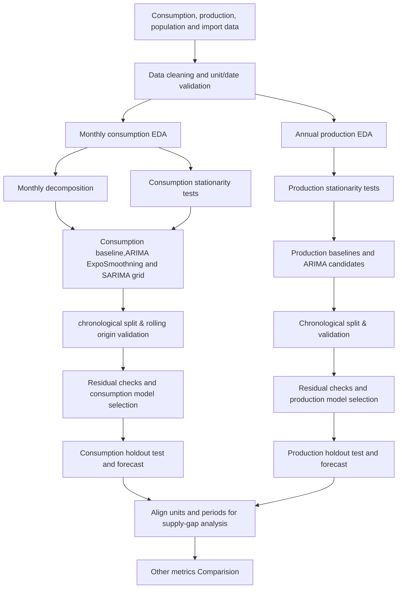

# Workflow

```mermaid
flowchart TD
    A[Consumption, production, population and import data] --> B[Data cleaning and unit/date validation]
    B --> C1[Monthly consumption EDA]
    B --> C2[Annual production EDA]
    C1 --> D1[Monthly decomposition]
    C1 --> E1[Consumption stationarity tests]
    C2 --> E2[Production stationarity tests]
    D1 --> F1[Consumption baseline,ARIMA ExpoSmoothning and SARIMA grid]
    E1 --> F1
    E2 --> F2[Production baselines and ARIMA candidates]
    F1 --> G1[chronological split & rolling origin validation]
    F2 --> G2[Chronological split & validation]
    G1 --> H1[Residual checks and consumption model selection]
    G2 --> H2[Residual checks and production model selection]
    H1 --> I1[Consumption holdout test and forecast]
    H2 --> I2[Production holdout test and forecast]
    I1 --> J[Align units and periods for supply-gap analysis]
    I2 --> J
    J --> K[Other metrics Comparision]
```

 